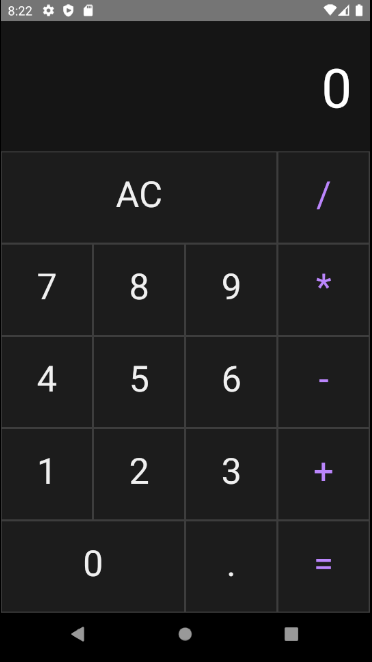

# Calculator

Este aplicativo é uma calculadora desenvolvida totalemnte com React Native e nas suas funcionalidade.

## Instalação

Antes de iniciar com a instalação do aplicativo em si, é necessário fazer a preparação do ambiente, através da própria documentação do React Native. Acesse a documentação de preparação de ambiente [aqui](https://reactnative.dev/docs/environment-setup).

Para realizar a instalação, após ter todo o seu ambiente de desenvolvimento preparado para isso, precisamos rodar "npm install" para fazer a instalação das dependências.

```bash
npm install
```
Após isso precisamos inicializar o AVD, para a instalação do aplicativo, através do Android Studio > Settings > AVD Manager.

Com o AVD aberto, precisamos abrir dois terminais na pasta do projeto, um para o servidor que rodará as mudanças de código e outro para a instalação do aplicativo.

```bash
npx react-native start
```

```bash
npx react-native run-android
```

## Preview



## Licença
[MIT](https://choosealicense.com/licenses/mit/)
