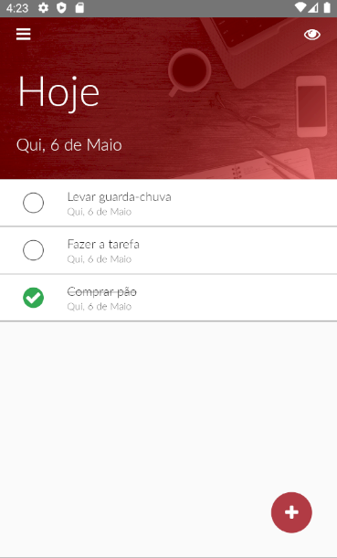

# Tasks

Este aplicativo é um sistema desenvolvido com React Native que para um aplicativo de Tasks. Utilizando de Frontend e Backend separadamente, para funcionalidades online.

## Frontend
### Instalação

Antes de iniciar com a instalação do aplicativo em si, é necessário fazer a preparação do ambiente, através da própria documentação do React Native. Acesse a documentação de preparação de ambiente [aqui](https://reactnative.dev/docs/environment-setup).

Para realizar a instalação, após ter todo o seu ambiente de desenvolvimento preparado para isso, precisamos rodar "npm install" para fazer a instalação das dependências.

```bash
npm install
```
Após isso precisamos inicializar o AVD, para a instalação do aplicativo, através do Android Studio > Settings > AVD Manager.

Com o AVD aberto, precisamos abrir dois terminais na pasta do projeto, um para o servidor que rodará as mudanças de código e outro para a instalação do aplicativo.

```bash
npx react-native start
```

```bash
npx react-native run-android
```

## Backend
### Instalação

Para realizar a instalação do backend, é necessário primeiramente acessar a pasta "server" do repositório. Dentro dela podemos realizar a instalação das dependências com "npm install".

```bash
npm install
```

Com as dependências instaladas é necessário fazer o uso de um servidor PostgreSQL, realizando a instalação e a configuração, e passando as informações de login do banco de dados, no arquivo "knexfile.js". Após isso, é preciso executar as migrations para preenchimento do banco com "npx knex migrate:latest".

```bash
npx knex migrate:latest
```

Finalmente, com o banco finalizado já é possível rodar o sistema, com o uso do comando "npm start".

```bash
npm start
```

## Uso

Com o aplicativo rodando, podemos criar uma conta ou fazer login para utilização do aplicativo.

## Preview


